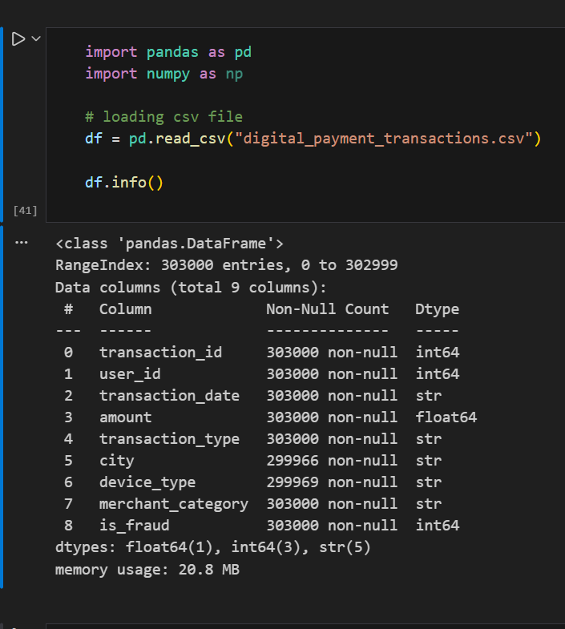
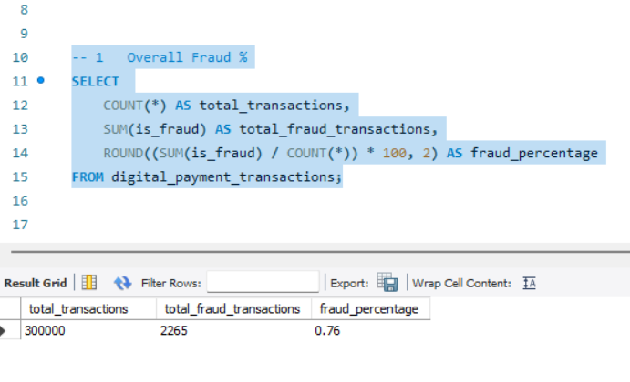
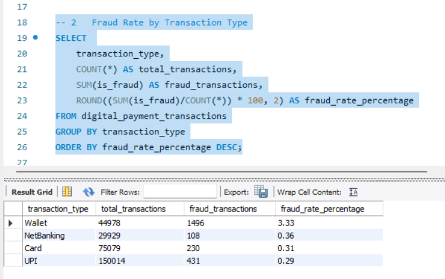
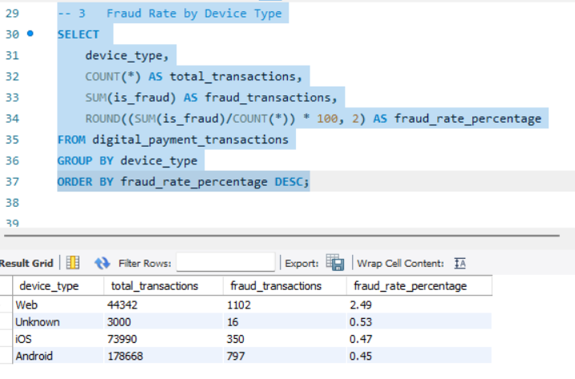
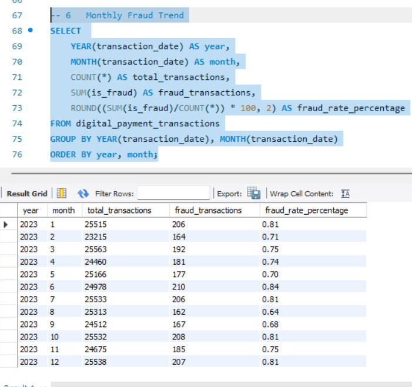

# 📊 FinTech Fraud Analysis (Python + MySQL)

## 📊 Project Summary

| Metric | Value |
|------|------|
| Dataset Size | 300,000 Transactions |
| Fraud Records | ~3% |
| Tools Used | Python, MySQL |
| Analysis Type | Fraud Pattern Detection |
| Queries Written | 15+ Analytical Queries |

## 📌 Project Overview

This project analyzes fraud patterns in digital payment transactions using **Python for data cleaning and preparation** and **MySQL for analytical fraud detection queries**.

The dataset contains **300,000 simulated digital payment transactions** including transaction details, device usage, merchant categories, and fraud labels.

The objective of this project is to perform **end-to-end data analysis** to:

- Clean and validate raw transaction data
- Identify fraud patterns across different transaction channels
- Analyze behavioral characteristics associated with fraud
- Detect high-risk segments across devices, locations, and merchant categories
- Measure fraud exposure through analytical SQL queries

This project demonstrates **core Data Analyst skills including data cleaning, SQL analytics, and fraud pattern analysis**.

---

# 📂 Dataset Description

The dataset represents digital payment transactions and contains the following attributes:

| Column | Description |
|------|------|
| transaction_id | Unique identifier for each transaction |
| user_id | Unique identifier for the user |
| transaction_date | Date of the transaction |
| amount | Transaction value |
| transaction_type | Payment method used |
| city | Location of transaction |
| device_type | Device used for transaction |
| merchant_category | Merchant business category |
| is_fraud | Fraud label (1 = fraud, 0 = legitimate) |

The dataset includes **300,000 transaction records** used for fraud analysis.

---

# 🛠 Tools and Technologies

### Python
- Pandas
- VS Code
- Jupyter Notebook

### Database
- MySQL Workbench

---

# ⚙️ Project Workflow

## 1️⃣ Data Preparation and Cleaning (Python)

The dataset was first analyzed and cleaned using Python.

Steps performed:

- Loaded dataset using **Pandas**
- Checked dataset structure using `df.info()`
- Identified missing values
- Handled null values in categorical attributes
- Validated numerical columns
- Removed duplicate records
- Verified data types
- Exported cleaned dataset for SQL analysis

### Data Quality Check

---

# 🔎 Fraud Analysis Using SQL

After cleaning the dataset, it was imported into **MySQL** for fraud analytics.

Multiple SQL queries were written to analyze fraud patterns across different transaction dimensions.

---

## 📈 Overall Fraud Rate

This query calculates the percentage of fraudulent transactions in the dataset.

---

## 💳 Fraud Rate by Transaction Type

Analyzing which transaction types show higher fraud exposure.

---

## 📱 Fraud Rate by Device Type

Device-based fraud analysis helps identify which devices are more frequently associated with fraudulent activity.

---

## 📅 Monthly Fraud Trend

Time-based fraud analysis to observe fraud patterns across different months.

---

# 📊 Additional Analysis Performed

Beyond the examples shown above, additional analytical queries were performed to understand fraud behavior in greater depth:

- Fraud rate by **merchant category**
- Fraud analysis by **transaction amount ranges**
- Fraud patterns by **city and location**
- Identification of **users with repeated fraudulent transactions**
- Detection of **high-risk user accounts**
- Calculation of **total fraud exposure by transaction value**
- Multi-dimensional fraud analysis across **city, device type, and transaction type**
- Ranking segments with the **highest fraud probability**

These analyses help uncover **behavioral and structural patterns associated with fraudulent transactions**.

---

# 📌 Key Insights

Some key insights identified from the analysis:

- Fraud rates vary across **transaction types and payment channels**
- Certain **device types show higher fraud activity**
- Fraud patterns differ across **merchant categories**
- A small group of users are responsible for **multiple fraudulent attempts**
- Fraud activity can be monitored using **time-based analysis**
- High-risk segments can be detected through **multi-dimensional SQL analysis**

---

# 📁 Repository Structure
fintech-fraud-analysis
│
├── data
│ └── digital_payment_transactions_cleaned.csv
│
├── python
│ └── data_cleaning_eda.ipynb
│
├── sql
│ └── fraud_analysis_queries.sql
│
├── images
│ ├── data_quality_check.png
│ ├── overall_fraud_rate.png
│ ├── fraud_by_transaction_type.png
│ ├── fraud_by_device.png
│ └── monthly_fraud_trend.png
│
└── README.md

---

# 👨‍💻 Author
CHAITANYA SHARMA
Data Analyst Portfolio Project  
Fraud Detection Analysis using **Python and MySQL**
